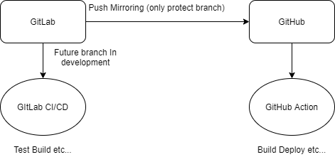

# chart_app

## 使用技術
- Backend
    - Django RestFrameworks
- Frontend
    - TypeScript + Next.js

## Backend
[バックエンド用のReadme](./backend/README.md)

## Frontend
[フロントエンド用のReadme](./frontend/README.md)

## リポジトリ構成
